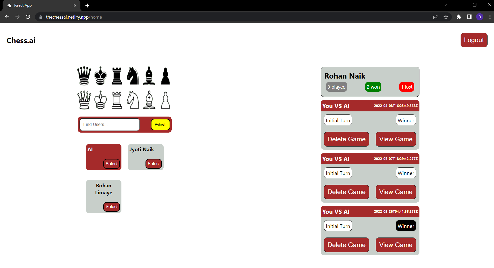
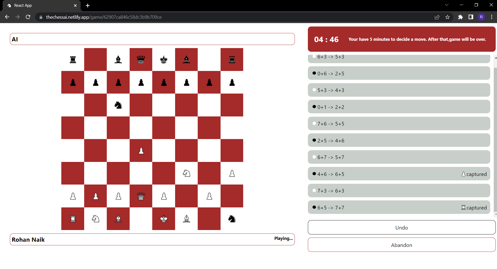
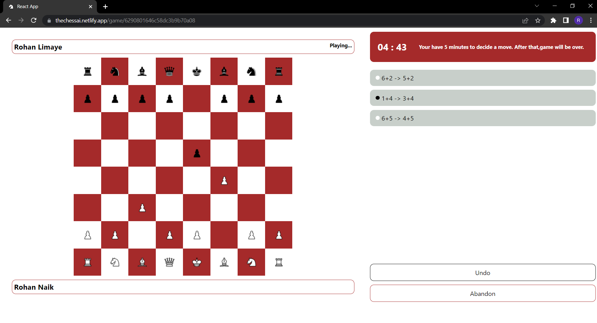

<div id="top"></div>
<!--
*** Thanks for checking out the Best-README-Template. If you have a suggestion
*** that would make this better, please fork the repo and create a pull request
*** or simply open an issue with the tag "enhancement".
*** Don't forget to give the project a star!
*** Thanks again! Now go create something AMAZING! :D
-->


<!-- PROJECT SHIELDS -->
<!--
*** I'm using markdown "reference style" links for readability.
*** Reference links are enclosed in brackets [ ] instead of parentheses ( ).
*** See the bottom of this document for the declaration of the reference variables
*** for contributors-url, forks-url, etc. This is an optional, concise syntax you may use.
*** https://www.markdownguide.org/basic-syntax/#reference-style-links
-->

<br />
<div align="center">
  <a href="#">
    
  </a>

  <h3 align="center">Chess.ai</h3>

  <p align="center">
     A real time chess game which you can play with friend or an AI bot.
    <br />
    <br />
    <a href="https://thechessai.netlify.app">View Demo</a>
    ·
    <a href="https://github.com/rohan-naik07/chess-ai/issues">Report Bug</a>
    ·
    <a href="https://github.com/rohan-naik07/chess-ai/issues">Request Feature</a>
  </p>
</div>

<!-- TABLE OF CONTENTS -->
<details>
  <summary>Table of Contents</summary>
  <ol>
    <li>
      <a href="#about-the-project">About The Project</a>
      <ul>
        <li><a href="#built-with">Built With</a></li>
      </ul>
    </li>
    <li>
      <a href="#getting-started">Getting Started</a>
      <ul>
        <li><a href="#prerequisites">Prerequisites</a></li>
        <li><a href="#steps-for-running-the-app">Steps for running the app</a></li>
      </ul>
    </li>
    <li><a href="#usage">Usage</a></li>
    <li><a href="#contributing">Contributing</a></li>
    <li><a href="#license">License</a></li>
    <li><a href="#contact">Contact</a></li>
  </ol>
</details>

<!-- ABOUT THE PROJECT -->
## About The Project

Chess.ai is a portal in which you can play chess with a friend or with a bot. You can sign up on the portal using simple user name and password. The bot uses minimax algorithm with alpha beta pruning and is hosted on backend. The games played are stored in a NoSQL database, which your can retrieve and analyze. 

<br/>
<strong>Home Page</strong>
<br/>
<br/>

<br/>
<strong>Play with AI</strong>
<br/>
<br/>

<br/>
<strong>Play with Friend</strong>
<br/>
<br/>

<br/>

Here are some issues in the project which you can contribute on :
* The AI needs to be optimized. Currently it takes 1-2 seconds for inference.
* There is a timer of 5 minutes during which you can decide your next move. The timer should be variable according to user needs.
* I am not a professional chess player. I have implemented all the rules of the game as well as castling, en passant and pawn promotion.But still if you feel some rule of the game is missing or not working as expected, do contribute. Such fixes of features are always welcome !

Contributing guidelines are given below.

<p align="right">(<a href="#top">back to top</a>)</p>

### Built With

* [React.js](https://reactjs.org/)
* [Express.js](https://expressjs.com/)
* [Node.js](https://nodejs.org)
* [MongoDB](https://www.mongodb.com/)
* [Socket-IO](https://socket.io/)

<p align="right">(<a href="#top">back to top</a>)</p>

## Getting Started

### Prerequisites

Following packages need to be installed in order for the app to run.
* node-js
* mongo-db
* npm
  ```sh
  npm install npm@latest -g
  ```
* docker (optional)

### Steps for running the app

<strong>Without docker</strong>

1. Clone the repo
   ```sh
   git clone https://github.com/your_username_/Project-Name.git
   ```
2. Install all the node packages in the root folder
   ```sh
    npm install
   ```
3. Create .env file in root folder set up environment variables 
   ```sh
    REACT_APP_sURL=http://localhost:7000 # backend url
    REACT_APP_URL=http://localhost:3000  # frontend url
   ```
4. Install all the node packages in the backend folder
   ```sh
   cd backend
   npm install
   ```
5. Create .env file in backend folder set up environment variables 
   ```sh
    jwt_key=key # secret key for generating and verifying jwt tokens
    db_URL=mongodb://mongo:27017/test # db url
   ```
6. Start react app
    ```sh
    npm start
    ```
7. Start backend
    ```sh
    cd backend
    npm start
    ```
<br/>

<strong>With docker</strong>
<br/>
_Make sure that docker is running._
<br/>

1. Clone the repo
   ```sh
   git clone https://github.com/rohan-naik07/chess-ai.git
   ```
2. Run docker compose
   ```sh
    docker compose up
   ```
   
<p align="right">(<a href="#top">back to top</a>)</p>

<!-- CONTRIBUTING -->
## Contributing

Contributions are what make the open source community such an amazing place to learn, inspire, and create. Any contributions you make are **greatly appreciated**.

If you have a suggestion that would make this better, please fork the repo and create a pull request. You can also simply open an issue with the tag "enhancement".
Don't forget to give the project a star! Thanks again!

1. Fork the Project
2. Create your Feature Branch (`git checkout -b feature/AmazingFeature`)
3. Commit your Changes (`git commit -m 'Add some AmazingFeature'`)
4. Push to the Branch (`git push origin feature/AmazingFeature`)
5. Open a Pull Request

<p align="right">(<a href="#top">back to top</a>)</p>

<!-- USAGE EXAMPLES -->
## Usage

1. Create an account 
2. Search for user, choose your color and copy the generated link
3. Select on a piece you want to move, the cell will become grey
4. Now click on the cell you want to place the selected piece, the piece will move on that cell.
5. You can undo your moves and abandon the game as well
6. View or delete the stored game
7. Logout

<p align="right">(<a href="#top">back to top</a>)</p>

<!-- LICENSE -->
## License

Distributed under the MIT License. See `LICENSE.txt` for more information.

<p align="right">(<a href="#top">back to top</a>)</p>

<!-- CONTACT -->
## Contact

Rohan Naik  - https://www.linkedin.com/in/rohan-naik07/

Project Link: - https://github.com/rohan-naik07/chess-ai

<p align="right">(<a href="#top">back to top</a>)</p>

